# SonarQube Dashboard & Pipeline for Visual Studio Code

**English** | [Español](README.es.md)

Technical user guide for configuring, synchronizing, analyzing, and operating SonarQube projects and local quality pipelines from Visual Studio Code.

**Connect SonarQube, run configurable quality pipelines, inspect Quality Gates, issues, Security Hotspots, coverage, duplication, and execution history without leaving VS Code.**

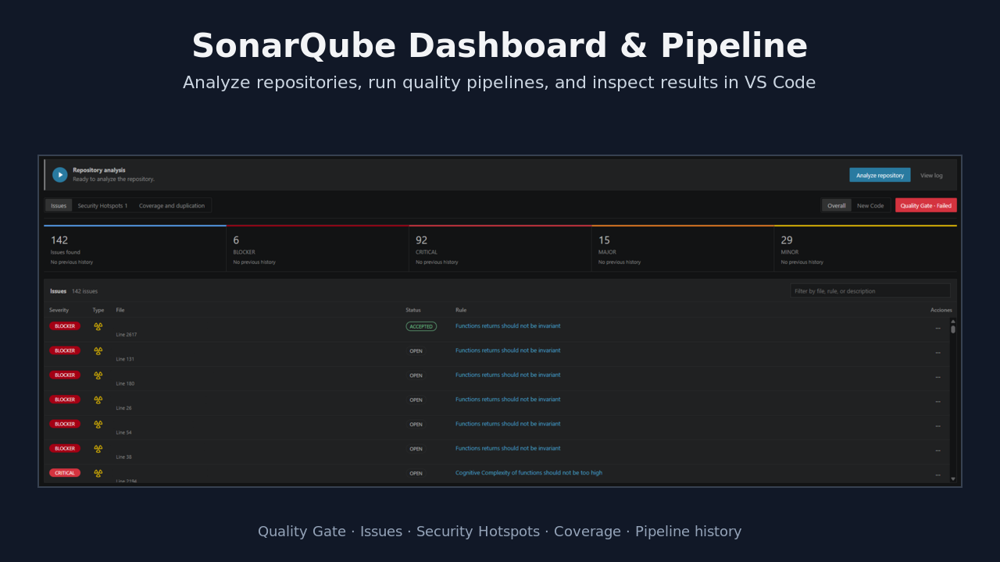

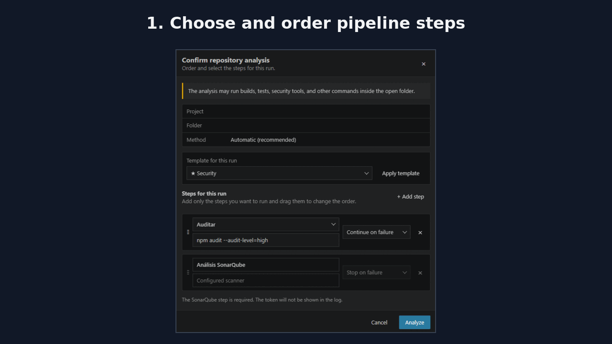

For a guided first run, open the Command Palette and execute **SonarQube Dashboard & Pipeline: Get Started**. The native walkthrough opens the dashboard, guides the SonarQube connection, launches the first pipeline, and points to the result views.

> **Community extension:** this project is independent and is not affiliated with, endorsed by, or maintained by SonarSource. SonarQube is a trademark of SonarSource SA.

## Functional scope

| Area | Technical behavior |
|---|---|
| Modules | Pipeline and Live Remediation can be enabled independently; disabled modules hide their configuration tabs and native views and stop their runtime work. |
| SonarQube connection | Validates the configured server and token, lists accessible projects, and stores the selected project per workspace folder. |
| Synchronization | Retrieves issues, Security Hotspots, Quality Gate conditions, ratings, measures, history, coverage, and duplication data. |
| Local file mapping | Matches SonarQube component paths to files inside the active workspace folder and optional local subfolder. |
| Repository analysis | Detects Maven, Gradle, .NET, NPM, Docker, or a custom scanner command and executes it in the workspace. |
| Quality pipeline | Runs build, test, audit, security, SonarQube, and custom commands in the selected order with per-step failure policies. |
| Editor integration | Publishes Problems entries, gutter decorations, hovers, CodeLens, issue flows, coverage, and duplication indicators. |
| Live remediation | Tracks net changes to synchronized issues inside the editor and across external/multi-file operations, provides Server ↔ Local diff and guarded revert, persists remediation sessions and pending changes, and separates the latest real analysis into Solved and Still detected results. |
| Execution history | Stores the latest 30 pipeline executions per analysis folder, including status, duration, steps, bounded log output, and the exact before/after quality baseline for each completed run. |
| Diagnostics | Reports environment, compatibility, scanner, detected commands, tools, server latency, and the latest failed request with secrets redacted. |

## Modular architecture in 2.0.0

Version 2.0.0 separates **Core**, **Pipeline**, and **Live Remediation** as real source-code and runtime boundaries. Open **Configuration → Modules** to control the optional features independently:

- **Core** owns only SonarQube connection/synchronization, Dashboard, navigation, decorations, and the normal server diagnostic snapshot published to **Problems**. It does not import module-internal scanner types, services, controllers, or managers.
- **Pipeline** lives entirely under `src/modules/pipeline/` and owns scanner detection/execution, analysis scope, steps, templates, integrations, history, baseline comparison, commands, native view, configuration, and webview contribution. Its settings use the dedicated `sonarQubeDashboard.pipeline.*` namespace.
- **Live Remediation** lives entirely under `src/modules/liveRemediation/` and owns local tracking, file watchers, baseline, diff/revert, persistence, remediation session, latest-analysis results, history, commands, and native view. It does not import Pipeline or know its concrete commands.
- Both modules implement a common contract and are mounted through a **generic module registry/runtime**. Core talks to optional features only through contracts, contributions, and capabilities, so another module can be added without placing its implementation inside `DashboardPanel` or `extension.ts`.
- Cross-module behavior goes through a generic capability broker. For example, **Analyze repository** from Live Remediation requests the `analyzeRepository` capability; Pipeline provides it only while enabled. There is no `Live Remediation → Pipeline` dependency.
- The Dashboard webview consumes one module-contribution facade. Each module owns its own tab, markup, scripts, styles, dialogs, and pages; reusable controls live under `src/shared/webview/`, eliminating Dashboard ↔ module UI cycles.
- Modules can be enabled or disabled at runtime. When the dashboard opens or refreshes, optional configuration tabs are always rebuilt from the persisted module state, including modules that were already enabled before the view opened. Disabling Pipeline cancels/disposes its services and commands. Disabling Live Remediation disposes listeners/watchers and immediately restores the normal **Problems** snapshot, while **preserving its persisted remediation session** for later reactivation.
- Clearing state and disabling a module are separate operations: only explicit trash/clear actions erase Live Remediation state. Disabling a module or restarting VS Code never reverts local files and does not erase the remediation session.
- Enabling or disabling a module requires a native confirmation modal. The checkbox remains at its last confirmed value while the decision and lifecycle transition are pending, and the new value is persisted only after the module has been loaded or unloaded successfully. If Pipeline is analyzing, the disable warning explicitly says the run will be cancelled. The switches are `sonarQubeDashboard.modules.pipeline.enabled` and `sonarQubeDashboard.modules.liveRemediation.enabled`; there is no second internal Live Remediation enable switch.
- Module lifecycle changes preserve **Configuration → Modules** while the Dashboard recomposes its module-owned HTML, CSS, and JavaScript. The rebuilt webview starts directly on the preserved page/tab instead of briefly displaying **Data** or **SonarQube**. If persisted state says that a module is enabled but its runtime is missing, synchronization repairs the mismatch and lazily loads the implementation again.

## Operating model

1. The active workspace folder provides the server, project, branch, local path, scanner, pipeline, and notification configuration.
2. The access token is read from VS Code `SecretStorage`; it is not stored in `settings.json`.
3. Synchronization queries the configured SonarQube server and maps returned component paths to local files.
4. Only findings whose files can be resolved inside the active folder are published to the local dashboard, Problems, editor decorations, and issue explorer.
5. Repository analysis executes the confirmed pipeline in the trusted workspace and streams output to the execution view.
6. Completed execution metadata is stored in workspace state with a maximum of 30 entries per analysis folder.
7. Changing the active folder switches to that folder's independent configuration and cancels obsolete requests.

## Installation

### Visual Studio Marketplace

Open **Extensions** in Visual Studio Code, search for **SonarQube Dashboard & Pipeline**, select the extension, and choose **Install**.

### VSIX package

1. Open the Command Palette with `Ctrl + Shift + P` or `Cmd + Shift + P`.
2. Run **Extensions: Install from VSIX...**.
3. Select `vscode-sonarqube-dashboard-pipeline-<version>.vsix`.
4. Reload the window when requested.

## Requirements

For SonarQube Dashboard & Pipeline to work correctly:

1. The application must already have been analyzed in SonarQube at least once.
2. The local folder for that same application must be open in Visual Studio Code.
3. The open folder must be linked to the corresponding SonarQube project from the **Configuration** tab.

The extension compares component paths returned by SonarQube with files found inside the open folder. The dashboard and **Problems** panel only show findings that can be matched to an existing local file.

When the analyzed code is located inside a workspace subfolder, configure it under **Advanced configuration → Local subfolder**. An incorrect project, folder, or subfolder mapping can cause SonarQube to contain issues that do not appear in the extension.

## Main features

- Run repository analysis from VS Code with automatic scanner detection and a two-step template/confirmation wizard that previews the effective folder and SonarQube analysis scope.
- Configurable analysis pipeline with build, test, predefined integration, and custom steps ordered through drag & drop.
- Reusable pipeline templates: **Quick**, **Complete**, **Security**, **Release**, and custom templates that can be imported or exported as versioned YAML.
- Native **Pipeline executions** view for recent runs, including live or historical status, duration, steps, log output, and before/after SonarQube baseline deltas.
- Automatic local **before/after baseline** around each repository analysis for Issues, Security Hotspots, Coverage, Duplication, and Quality Gate.
- Internal diagnostics page with environment, server, compatibility, scanner, tools, commands, last failed request, and server response time.
- Support for Maven and Gradle projects using Java or Kotlin, SonarScanner for .NET for C#/VB.NET/F#, SonarScanner for NPM for projects containing `package.json`, and SonarScanner CLI through Docker for generic projects.
- Manual selection of Maven, Gradle, .NET, NPM, Docker, or a custom command.
- Automatic synchronization when opening an already linked project.
- Independent configuration for each workspace folder.
- Interface language selector with immediate switching between English and Spanish.
- Token protection through `SecretStorage`.
- Global **Overall / New Code** selector.
- Summaries by severity and issue type.
- Maintainability, Reliability, Security, and Security Review ratings.
- Quality Gate status and full condition details.
- Filterable issue table with sortable headers and direct navigation to source code.
- Issue lifecycle management without leaving VS Code: accept, false positive, reopen, assignment, comments, history, and current assignee.
- In-editor information through decorations, hovers, quick actions, and CodeLens for issues and Security Hotspots.
- **Live Remediation 2.0** with net-change tracking inside/outside the editor, multi-file operations, Server ↔ Local diff, guarded per-issue revert, persistent sessions, pending changes restored after restart, an **After latest analysis** accordion with **Solved** / **Still detected**, navigation to the new server location, solved history, and independent cleanup actions. Only a real repository analysis can confirm a remediation.
- Security execution-flow navigation with source, intermediate steps, sink, secondary locations, and CodeLens.
- Coverage and duplication view with current Overall/New Code metrics, gutter decorations, duplicated blocks, low-coverage files, and Overall historical trends grouped by day, week, or month.
- Keyboard navigation, status-bar counter, and an issue explorer grouped by file, rule, or severity.
- Automatic regression notifications for critical issues, Quality Gate failures, issue increases, new hotspots, and completed analyses.
- Dedicated Security Hotspots table.
- File and rule rankings with sortable columns.
- Overall historical evolution by issue type and severity, with independent day, week, or month grouping and **Day** selected by default. New Code keeps its current metrics but intentionally hides non-comparable historical charts.
- Native diagnostics published in **Problems**.
- Support for branches and local subfolders.

## Quick start

1. Make sure the application already has at least one analysis available in SonarQube.
2. Open the local folder for that same application in VS Code.
3. Select the **SonarQube Dashboard & Pipeline** icon in the Activity Bar.
4. Open the **Configuration** tab.
5. Select **English** or **Español** from the language dropdown. The dashboard, side panel, notifications, dialogs, and scanner messages update immediately.
6. Enter the server URL and an access token.
7. Select **Connect** to validate the server and token and load the visible projects.
8. Explicitly select the SonarQube project or application that analyzes the open folder. Connecting never links a project automatically.
9. Optionally configure the branch and, when paths do not start at the workspace root, the local subfolder.
10. Select **Synchronize** to save the link and load its data.
11. On the **Data** page, select **Analyze repository**, add the optional steps for that run, and confirm the pipeline.

After the first link is created, the extension synchronizes data automatically whenever the workspace is opened. The refresh icon in the side panel can be used to request a manual update.

## Side panel


The side panel provides a quick overview without leaving the VS Code explorer:

- **Data / Configuration / Diagnostics:** open the summary, area-based configuration, or the extension's technical report.
- **Pipeline executions:** native VS Code view below the side-panel summary; lists active and completed runs and opens their detail page.
- **Refresh:** query SonarQube again and update both the dashboard and Problems.
- **Issues found:** total number of issues matched to files that exist in the linked folder.
- **Severities:** distribution of Blocker, Critical, Major, Minor, and Info among those local issues.
- **Types:** Bugs, Code Smells, Vulnerabilities, and Security Hotspots whose paths match a local file.
- **Quality Gate:** status of the latest analysis. Select it to open the detailed view.
- **Ratings:** direct Overall and New Code comparison using A–E badges.

While synchronization is running, the panel displays a spinner and temporarily hides the previous data to avoid presenting a partial state.

## Data view and Overall / New Code selector


The global **Overall / New Code** selector updates all of the following together:

- the top summary;
- the issues table;
- Security Hotspots;
- Top Files;
- Top Rules.

**Overall** represents the complete project state. **New Code** limits the current summaries, issues, hotspots, coverage, and duplication metrics to the new-code period configured in SonarQube.

Historical evolution is displayed only in **Overall**. The New Code definition can change between analyses, so its values are not always directly comparable as a time series. In New Code, the extension hides the issue, severity, coverage, and duplication evolution charts and displays an explanatory notice instead of artificial zero values.

### Top summary

Each column displays:

- the current value;
- the corresponding severity;
- the increase or decrease compared with the previous analysis;
- the official color used throughout the dashboard.

The `▲` and `▼` indicators make regressions and improvements easier to identify. When there is no variation, **No changes** is displayed.

Historical comparison is shown only when the total from the latest SonarQube analysis matches the issues associated with local files. When paths are omitted, the extension avoids comparing the local subset against the project's global total.

This top comparison always uses the analysis **immediately preceding** the latest available analysis. It is independent of the day, week, or month grouping selected in the evolution charts.

### Issues table

The table contains:

- **Severity:** issue criticality.
- **Type:** Bug, Code Smell, or Vulnerability icon.
- **File:** final filename and affected line; the tooltip preserves the complete path.
- **Rule:** descriptive SonarQube rule name.

The search field filters by file, rule, or description. The **Severity**, **Type**, **File**, **Status**, and **Rule** headers sort the table; selecting the same header again reverses the direction. Selecting a row opens the local file at the affected line. Selecting the rule opens its details in a dialog.

Only issues whose SonarQube component matches a file in the open folder are included, taking the configured local subfolder into account.

The header remains fixed while only the table body scrolls vertically.

### In-editor indicators, CodeLens, and issue details


When a file containing findings is opened, the extension marks the affected lines directly in the editor:

- the gutter, to the left of the line number, displays the same icon and color used in the summary for **Bug**, **Code Smell**, **Vulnerability**, and **Security Hotspot**;
- the affected line is highlighted with the corresponding finding-type color and a marker is added to the editor overview ruler;
- a CodeLens above the affected line shows severity, rule, and direct access to the details;
- hovering over the icon displays the description, rule, type, severity or priority, status, resolution, file, line, project, component, identifier, and available impacts;
- the tooltip link opens the complete issue or Security Hotspot details in **SonarQube Dashboard & Pipeline**;
- for SonarQube issues, the native VS Code light bulb exposes Quick Fix actions to **View rule**, **Mark as accepted**, **Assign issue to me**, **Open in SonarQube**, and **Manage issue in Dashboard**;

Remote Quick Fix actions use the SonarQube permissions associated with the configured token. If the current user cannot accept or assign an issue, the extension leaves it unchanged and reports that the operation is unavailable.

### Live remediation state

Live Remediation operates when the `sonarQubeDashboard.modules.liveRemediation.enabled` module is enabled. Its model is deliberately conservative: **changing code does not mean an issue is solved**. SonarQube Server remains the only source of truth, and a remediation is confirmed only from the snapshot produced by a real repository analysis.

File identity is normalized before matching editor, save, and filesystem events, including case differences in Windows file URIs. A direct edit on or adjacent to a synchronized issue range is therefore recorded immediately as **Modified locally**, even when an identical source line exists elsewhere in the same file.

#### Local-change tracking

- Editing a tracked issue range inside VS Code changes its CodeLens/hover to **Modified locally · pending validation** and republishes its Problems entry as informational. The tracked range follows insertions, removals, replacements, undo, and redo.
- Live Remediation compares the **net change** with the server baseline. If the code returns exactly to the original content —including through `Ctrl+Z`— the issue immediately leaves the pending state without requiring an extra edit.
- The module also observes file operations outside the editor: changes, saves, creates, deletes, renames, copies, and replacements from Explorer, a terminal, or other tools. Fast multi-file events are debounced/batched and followed by an additional reconciliation of the tracked-file set so filesystem event ordering/coalescing does not silently drop files.
- If an external replacement only shifts lines while the issue's original block is unchanged, the baseline is relocated instead of producing a false local modification. When equivalence cannot be proven safely, the module deliberately keeps the affected issue in a conservative modified state.
- If the official **SonarQube for IDE** extension previously reported the same finding, its diagnostics may be used only as an additional signal to move from **Modified locally · pending validation** to **Modified locally · awaiting SonarQube confirmation**. That local signal never confirms a remediation.

#### Diff and guarded revert

Every **Pending changes** entry uses the baseline captured from the latest SonarQube server snapshot:

- selecting an issue opens a deterministic **Server ↔ Local diff** containing the original block and the current local block;
- inline/context actions provide **View change**, **Go to code**, and **Revert this change**;
- revert restores only the block associated with that issue and requires confirmation through a native VS Code modal;
- before editing the file, Live Remediation validates the tracked range, original baseline range, and context anchors. If it cannot prove that the target block is safe, automatic revert is refused without modifying the file;
- reverting an issue does not save the file automatically, so it remains a normal VS Code edit and can still be undone.

#### Remediation Session

The native **Issues modified locally** view contains a **Remediation Session** with:

- **Started**, showing the session start time;
- **Analyze repository**, which runs Pipeline to obtain a new real SonarQube server snapshot;
- **Currently modified**, **Pending validation**, and **Pending server**, representing the current local pending state;
- **Pending changes (N)**, listing issues whose local state still differs from the server snapshot.

An ordinary synchronization, auto-refresh, or startup refresh **does not consume or validate Pending changes**. Only a refresh whose source is a real repository analysis can produce remediation-validation results.

#### After latest analysis

After a real analysis, the **After latest analysis** accordion contains only the results of that latest server validation:

- **Validated** shows the time of the snapshot that produced the result;
- **Solved (N)** contains modified issues that SonarQube no longer returned;
- **Still detected (N)** contains modified issues returned again by SonarQube. Each entry keeps the **new location from the latest server analysis**, so selecting it opens the file at the current line returned by SonarQube;
- **Solved history** keeps up to 20 earlier confirmations. This history contains only remediations actually confirmed by SonarQube Server.

Latest-analysis results are independent from accumulated history: every real analysis replaces the **Solved** and **Still detected** lists; when there is nothing pending to validate, both lists become empty. **Solved history** continues to retain prior confirmations.

#### Persistence and cleanup

The complete session is stored per workspace through `ExtensionContext.workspaceState` (schema v4, with automatic migration from pending-state schema v3). Reloading the window or restarting VS Code restores:

- **Pending changes**, `modified` / `awaitingConfirmation` states, ranges, and baselines;
- the session start time;
- the **After latest analysis** block, including Solved and Still detected results;
- Solved history.

Persisted pending entries are surfaced even while the first server refresh is still running, so the tree does not temporarily appear to lose local changes during startup.

The view provides independent trash actions, all protected by native confirmation modals:

- the **Remediation Session** trash action clears pending state, latest-analysis results, history, and local session persistence and starts a new clean session; **it does not revert or modify local files and does not modify SonarQube Server**;
- the **Solved** trash action clears only that latest-analysis list and keeps Solved history;
- the **Still detected** trash action clears only that latest-analysis list and does not touch Pending changes or source files.

The status-bar indicator is visible only while local pending state exists. Selecting it requests a Dashboard refresh, but final remediation confirmation remains reserved for the result of a real repository analysis.

Disabling the module disposes its watcher, listeners, timers, status-bar item, and native view. Normal **Problems** diagnostics remain core-owned and are restored immediately when Live Remediation is removed.

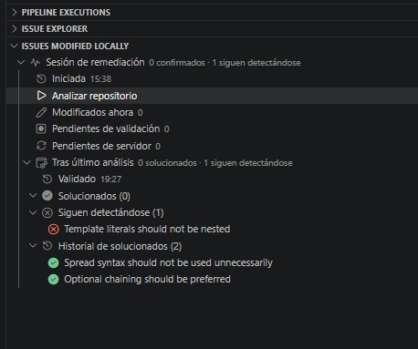


## Top Files and Top Rules


### Top Files

Groups issues by file and displays:

- final filename;
- complete path in the tooltip;
- highest severity found;
- total number of issues.

### Top Rules

Groups issues by rule and displays:

- descriptive rule name;
- highest severity;
- number of occurrences.

Both tables can be sorted by selecting **File/Rule**, **Severity**, or **Issues**. Selecting the same header again reverses the order, and the `▲` or `▼` indicator shows the active direction.

The headers remain outside the scrollable area, and both tables keep the same height.

## Historical evolution


The lower section contains two charts:

- **Issues by type:** Bugs, Code Smells, Vulnerabilities, and Security Hotspots.
- **Issues by severity:** Blocker, Critical, Major, Minor, and Info.

Each chart has its own **Day / Week / Month** selector in the upper-right corner and starts grouped by **Day**. Selectors are independent, so changing one chart's grouping does not modify any other chart.

Each point represents the latest analysis in the selected interval: the latest analysis of each day, week, or month. Moving the pointer over a chart displays a tooltip that follows the cursor and shows that analysis's actual date and the values for every visible series.

The legends are centered and interactive. Select a series to hide it or display it again.

## Quality Gate


The Quality Gate button opens a dialog containing:

- global status of the latest analysis;
- number of failed and configured conditions;
- evaluated metric;
- current value;
- allowed limit;
- Overall or New Code scope;
- individual result for every condition;
- Overall and New Code ratings;
- number of Security Hotspots.

Failed conditions are listed first. The dialog distinguishes between the total number of configured conditions and the failed conditions displayed by SonarQube in its interface.

The dialog is divided into **header**, **body**, and **footer**. Only the body scrolls, so the title and action buttons remain visible.


## Issue lifecycle management

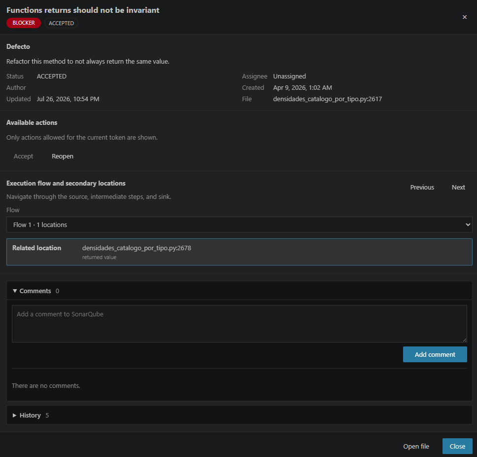

Select **Manage issue** from the Issues table, an editor hover, or the issue explorer to open the lifecycle dialog. Depending on the operations returned by SonarQube for the current token, the dialog can:

- accept an issue;
- mark it as false positive or won’t fix;
- reopen, confirm, or resolve it;
- assign or unassign a user;
- add comments;
- inspect comments, change history, author, dates, status, resolution, and assignee.

Every write operation displays a native confirmation dialog before SonarQube is modified. Status buttons are created only from the transitions included by `/api/issues/search`; assignment controls follow the actions returned for the issue, and the available-user list is paginated. Server-side authorization remains the final source of truth and API errors are displayed without discarding the current dashboard state.

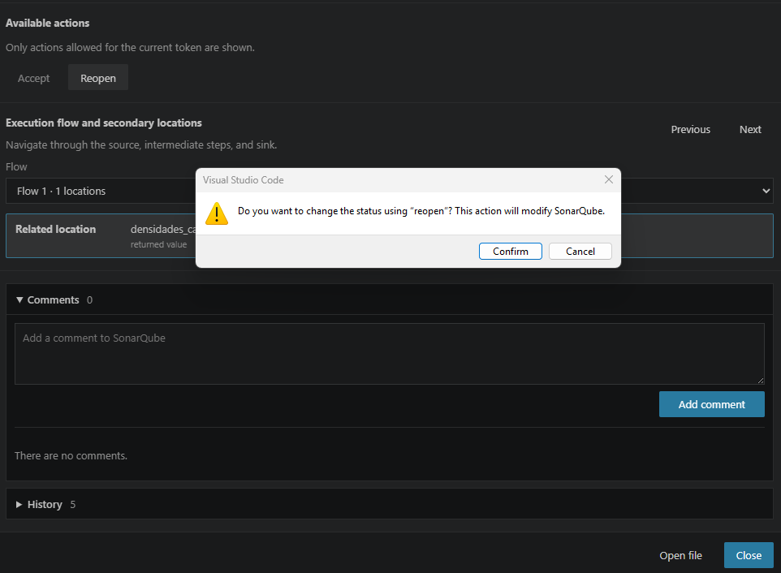

The current status is displayed in the Issues table and in the dialog; its matching action is disabled. Comments and history use mutually exclusive collapsible sections.

## Security flows and secondary locations

Issues that include execution flows expose all local locations involved in the finding:

- source;
- intermediate steps;
- sink;
- other related locations.

The lifecycle dialog includes **Previous** and **Next** controls and a complete location list. Selecting a location opens the corresponding file and line. While a flow is active, VS Code displays colored whole-line decorations and CodeLens entries so the path can be followed directly in the editor.

Locations that are part of the SonarQube flow but do not exist in the open workspace remain visible as unavailable and are never redirected to a different file with the same name.

## Coverage and duplications

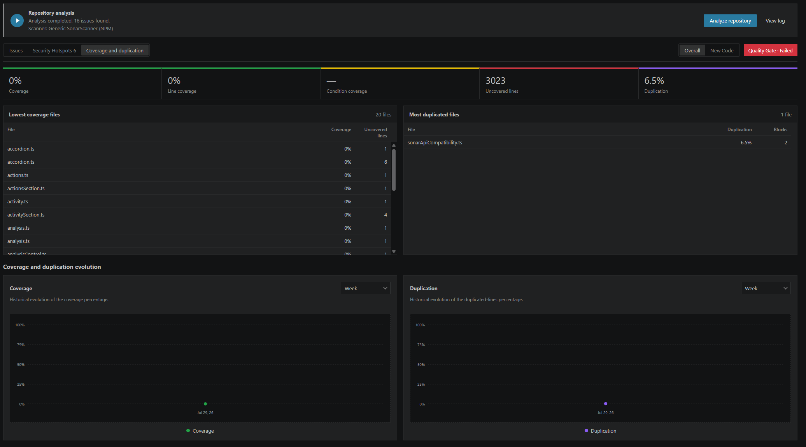

The **Coverage and duplication** data tab provides separate current Overall and New Code views for:

- coverage, line coverage, and condition coverage;
- lines to cover and uncovered lines;
- duplicated-line density, duplicated blocks, and duplicated lines;
- files with the lowest coverage;
- files with the highest duplication.

Historical coverage and duplication charts are available in **Overall** only. They provide independent **Day / Week / Month** selectors, start grouped by **Day**, and retain the latest analysis from each interval. In **New Code**, the current metrics and file rankings remain available, while the historical charts are replaced with a notice explaining why the series is unavailable.

Selecting a file loads line-level data on demand. Covered, partially covered, and uncovered lines are marked in the gutter and overview ruler. Duplicated lines receive a dedicated decoration, and the detail dialog lists each duplicated block together with every matching local file and range.

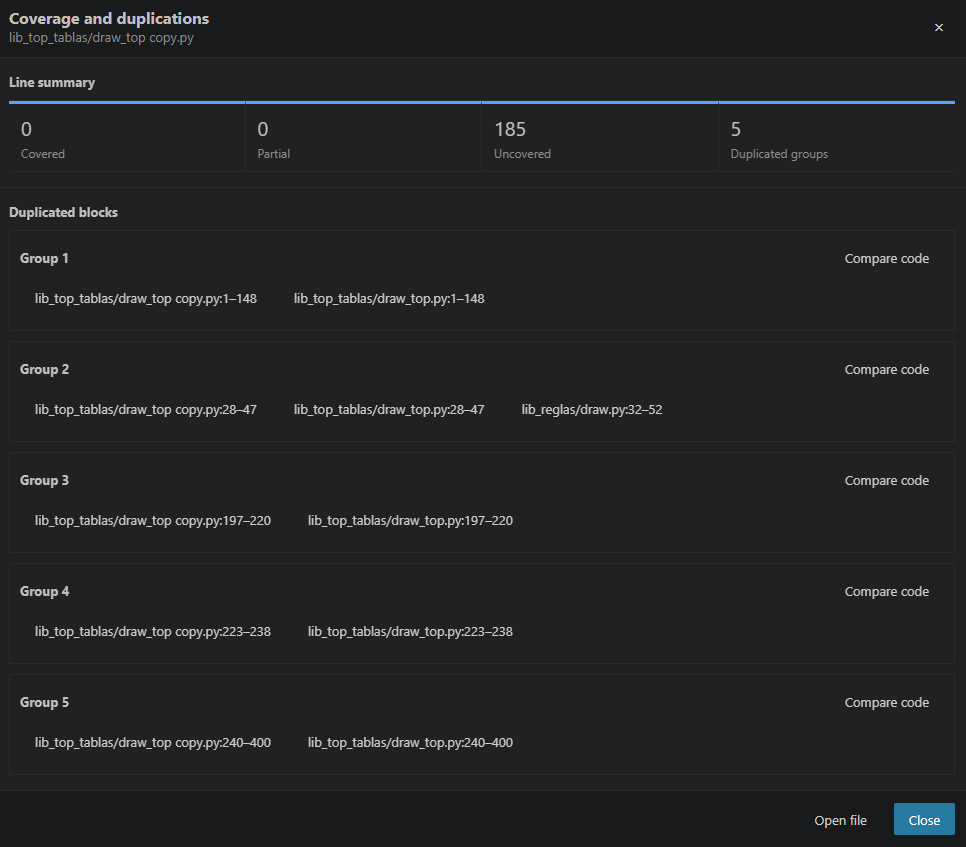

Non-empty duplicated lines display the word `duplicated` in purple at the end of the code. Empty or whitespace-only lines do not receive this visual label.

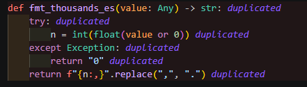

Each duplication group can be opened in a dedicated Git-style comparison tab. It displays every local occurrence side by side with its original line numbers and provides direct navigation to the selected range.

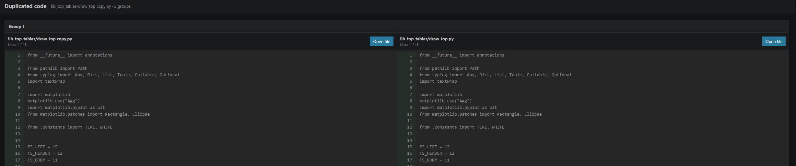

Coverage requires the corresponding test reports to have been imported by the scanner during analysis. When SonarQube has no coverage data for a file, the extension leaves it undecorated.
Missing historical metrics are also displayed as unavailable rather than as an artificial 0%.

## Quick issue navigation

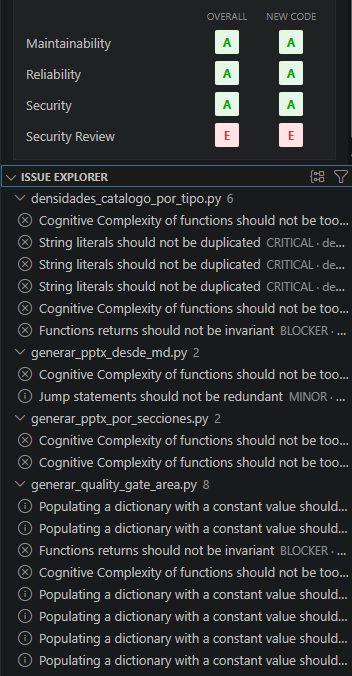

The extension contributes an **Issue explorer** below the side-panel summary. It can group local issues by file, rule, or severity and can be restricted to the active file.

Default shortcuts:

| Action | Windows/Linux | macOS |
|---|---|---|
| Next issue | `Ctrl+Alt+Down` | `Cmd+Alt+Down` |
| Previous issue | `Ctrl+Alt+Up` | `Cmd+Alt+Up` |
| Next issue of the same type | `Ctrl+Alt+T` | `Cmd+Alt+T` |
| Next Blocker/Critical issue | `Ctrl+Alt+C` | `Cmd+Alt+C` |

The status bar shows the current position, for example `3/12`, and opens the next issue when selected.
When you open or switch to a file that already has SonarQube diagnostics in **Problems**, the editor automatically reveals the first SonarQube issue in that file and places the cursor on its diagnostic range.
The explorer and navigation commands follow the active Overall/New Code scope.
Right-click a file group and select **Copy all file issues** to copy its path and every visible issue, including line, severity, type, status, resolution, rule, description, rule key, and issue key.

## Automatic notifications

Notifications can be enabled or disabled from the dashboard configuration or VS Code settings. The extension notifies when synchronization detects:

- new Blocker, Critical, or High issues;
- a Quality Gate change from OK to WARN/ERROR;
- a configurable significant increase in local issues;
- new Security Hotspots;
- completion of an analysis launched by the extension.

The default significant-increase threshold is 20% with at least five additional issues. These values can be changed through `sonarQubeDashboard.notifications.significantIncreasePercent` and `sonarQubeDashboard.notifications.significantIncreaseMinimum`.
Notification baselines are persisted independently for each workspace folder, server, project, branch, and VS Code workspace.

## Security Hotspots


The **Security Hotspots** tab provides a dedicated view containing:

- High, Medium, or Low priority;
- To Review, Acknowledged, Fixed, or Safe status;
- file and line;
- rule or description;
- text filter;
- **Pending only** option.

Selecting a hotspot loads its details and opens a dialog containing:

- description;
- risk;
- vulnerability context;
- remediation guidance;
- direct access to the file.

The extension loads hotspot details on demand so they do not delay the initial dashboard load.

## Detected integrations

When the **Pipeline** module is enabled, configuration includes a separate **Configuration → Integrations** tab. The view is split into two accordions: **Available**, open by default with tools detected in the workspace, and **Unavailable**, closed by default with the remaining supported integrations. For undetected tools, the UI shows a suggested command or configuration hint when possible. The extension never runs those instructions or installs tools automatically.

Detection is based on configuration files, scripts, and dependencies present in the project. For Node projects, the extension automatically detects the package manager from the `packageManager` field in `package.json` first and then falls back to common lockfiles (`package-lock.json`/`npm-shrinkwrap.json`, `pnpm-lock.yaml`, `yarn.lock`, `bun.lock`, or `bun.lockb`). Suggested catalog commands are adapted to the detected manager, for example `npm install -D eslint`, `pnpm add -D eslint`, `yarn add -D eslint`, or `bun add -d eslint`. When a Node tool is already available, detected commands also use the executor associated with the project's package manager. None of these commands is run automatically.

It currently recognizes, among others:

- SonarQube for the configured project;
- dependency auditing with `npm audit`, `pnpm audit`, `yarn audit`, or `bun audit`;
- ESLint, Biome, Stylelint, and Prettier;
- React Doctor;
- Semgrep, Trivy, and Snyk;
- OWASP Dependency-Check for Maven or Gradle;
- Ruff and Bandit for Python;
- Checkov for infrastructure as code;
- golangci-lint for Go.

An integration is **available** only when its configuration, dependency, script, or specific evidence is detected (or, for SonarQube, when a project is configured). Each available integration with an executable command offers **Add to available steps**. The Pipeline module re-validates detection in the extension host, avoids command duplicates, and saves the tool as a reusable step under **Configuration → Pipeline → Pipeline steps**. From there, the step can be selected in any template like any other custom step. The template editor only exposes the integration as a reusable source after it has been added to the available steps; built-in templates that already adapt to detected tools keep that adaptive behavior. SonarQube is not duplicated because it is the native required analysis step.

The **Unavailable** accordion acts as a catalog of integrations the plugin knows how to recognize and explains how to make them available. All this logic remains owned by `src/modules/pipeline/`: the core only composes the module contribution and does not know about concrete integrations or pipeline steps.

## Configurable analysis pipeline

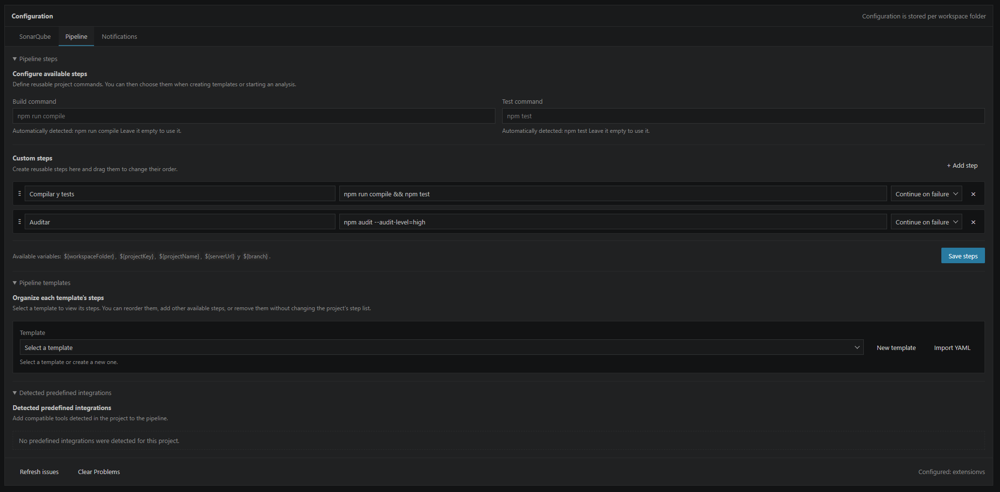

The **Configuration → Pipeline** tab automatically detects common build and test commands for the current project. Both commands can be overridden manually. Custom steps can also run dependency audits, linters, SAST tools, report generators, or any other tool available in the workspace.

Each custom step provides:

- editable name and command;
- drag & drop ordering from the `⋮⋮` handle;
- **Stop on failure** or **Continue on failure** behavior;
- `${workspaceFolder}`, `${projectKey}`, `${projectName}`, `${serverUrl}`, and `${branch}` variables;
- independent persistence through **Save pipeline**.

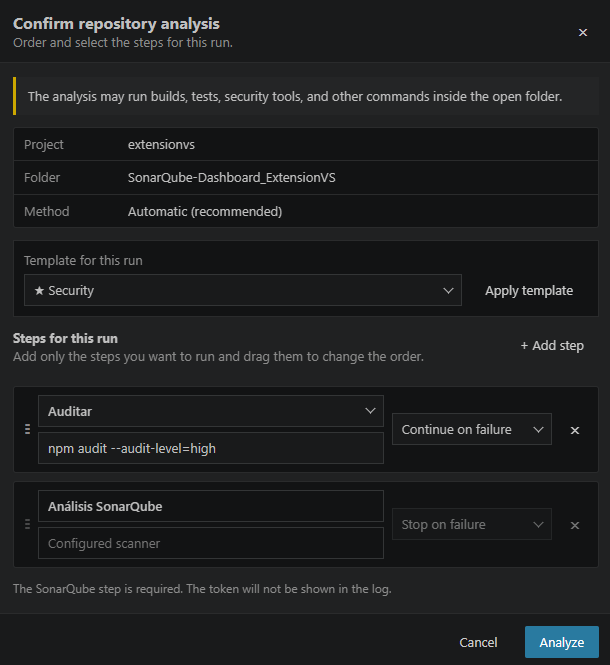

When **Analyze repository** is opened, the run initially contains only the required SonarQube step. **Add step** can include the detected build command, tests, or any saved custom step. The command can be adjusted for that run, and its position relative to SonarQube is controlled by dragging the row from its handle.

The **Analyze** button remains disabled while any step is incomplete. Optional steps can be removed before execution without changing the saved pipeline configuration.

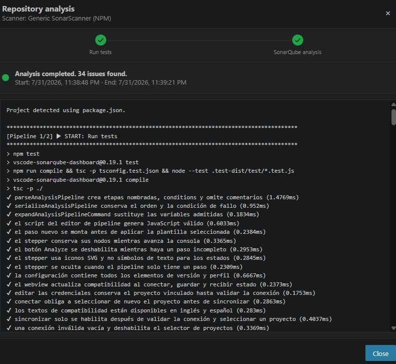

While the pipeline runs, the dialog displays a stepper whenever more than one step is present. Each stage indicates whether it is running, succeeded, failed and stopped the pipeline, or failed with permission to continue. The log clearly separates the start and end of each step, displays the executed command, and preserves the complete tool output.

## Pipeline templates


The extension provides a reusable template accordion under **Configuration → Pipeline**:

- **Quick:** build and SonarQube.
- **Complete:** build, tests, dependency audit, and SonarQube.
- **Security:** detected security tools and SonarQube.
- **Release:** every available step with a strict stop-on-failure policy.

Reusable steps are created first under **Pipeline steps**. The template editor then lets you select a template, inspect its steps, add other available steps, remove them, and reorder them through drag & drop without changing the project's main step list.

Built-in templates adapt to the commands and tools detected in the folder. **Save changes** updates the selected template for the workspace, including built-in templates, without creating duplicates. Custom templates are deleted with confirmation; deleting a workspace override for a built-in template restores its default definition. Templates can also be imported and exported as `.sonarqube-dashboard.yml` or another YAML file.

Starting a repository analysis now opens a two-step wizard. **Step 1 — Select template** lets you choose a template and adjust the ordered run steps; choosing a template applies its steps immediately and there is no separate **Apply template** action. Selecting **No template** restores the required SonarQube analysis step for manual customization. **Step 2 — Confirmation** summarizes the project, effective analysis folder (including the configured local subfolder), scanner method, selected template, saved `sonar.inclusions` / `sonar.exclusions`, and the exact ordered steps before **Analyze** becomes the final action.

The exported format uses `version: 1` and preserves step order, including steps placed after SonarQube:

```yaml
version: 1
name: "Local release"
description: "Versioned workspace pipeline"
steps:
  - id: "build"
    name: "Build"
    kind: build
    command: "npm run compile"
    failurePolicy: stop
    enabled: true
  - id: "sonarqube-analysis"
    name: "SonarQube analysis"
    kind: sonar
    command: ""
    failurePolicy: stop
    enabled: true
  - id: "report"
    name: "Publish report"
    kind: custom
    command: "npm run security-report"
    failurePolicy: continue
    enabled: true
```

## Before/after analysis baseline

Every repository analysis captures the current SonarQube project metrics **immediately before the pipeline starts**. The capture remains internal while the pipeline is running. After the scanner report has been processed and the dashboard refresh succeeds, the extension reads the same project again, stores the completed comparison with the pipeline execution, and renders it when that run is opened from **Pipeline executions**, for example:

- **Issues:** `71 → 64 (-7)`
- **Coverage:** `73.2% → 75.8% (+2.6 pp)`
- **Duplication:** `4.1% → 3.7% (-0.4 pp)`
- **Security Hotspots:** before/after count and delta
- **Quality Gate:** previous status → new status, with improvement/regression indication

When a metric has **no variation**, the history keeps the before/after value (for example `0 → 0`) but omits the neutral blue delta badge. Delta badges are therefore reserved for actual changes and the first-measurement state.

The snapshot is project-specific rather than workspace-aggregated and uses lightweight project-level measures instead of reloading the complete issue/file dataset, so multi-folder workspaces do not mix metrics from different SonarQube components or pay for an extra full dashboard refresh. If the project has never been analyzed, the extension labels the result as the **first measurement** and uses the published values as the baseline for the next run instead of comparing against artificial zeros.

The comparison is intentionally shown only in the **Pipeline executions** history detail, keeping the live repository-analysis modal and main dashboard focused on execution progress and current SonarQube data. It is persisted with each pipeline history entry, so opening an older run shows the values that belonged to that run even after newer analyses have changed the project again. Baseline collection is best-effort: if the pre-run metric query fails, the pipeline still runs normally and only the optional historical comparison is omitted.

## Pipeline run history

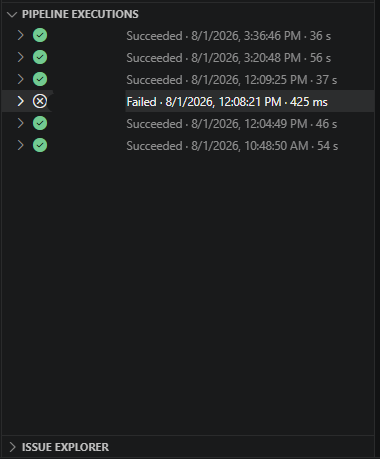


The native **Pipeline executions** view, located in the side bar next to the **Issue explorer**, keeps the latest 30 runs for each analysis folder. Active runs display a loading state, while completed runs show their result and duration.

Selecting any active or completed run opens a dedicated page that displays only that execution:

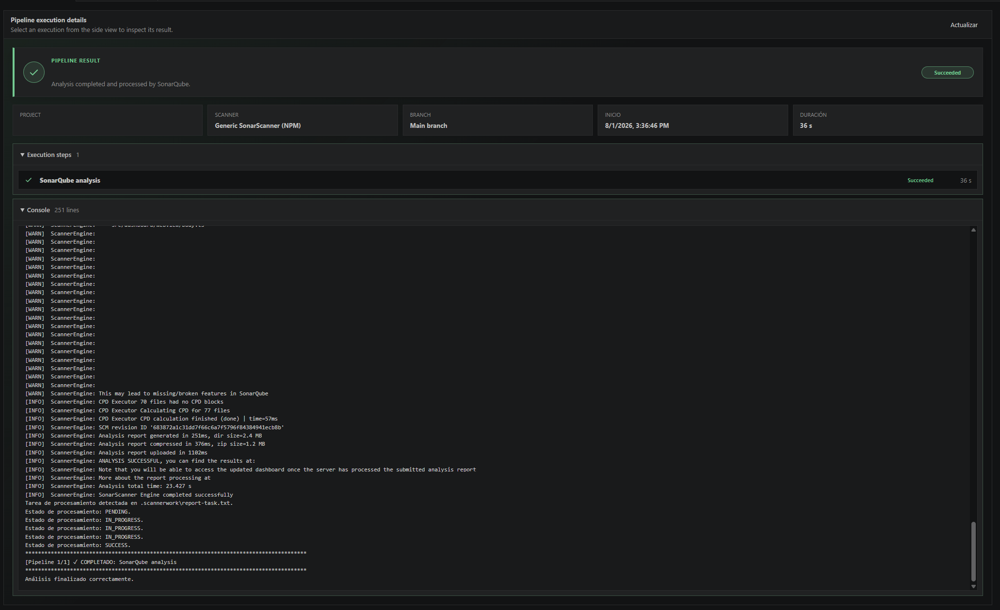

- project, branch, date, result, and total duration;
- the scanner used;
- status and duration for each step;
- allowed warnings, failures, and cancellations;
- animated accordions for steps and console output;
- live log updates while the run is active;
- capped historical logs to prevent unbounded workspace-state growth.

The page keeps the current execution visible while another one loads to avoid loading flashes. History is stored in workspace state, never includes the token, and can be cleared from the page.

## Internal diagnostics

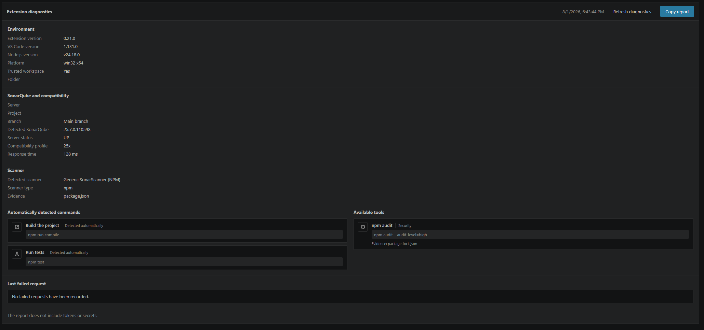

The **Diagnostics** tab collects information for investigating connection, compatibility, and project-detection problems:

- extension, VS Code, and Node.js versions;
- operating system, architecture, and workspace trust state;
- detected SonarQube version, status, compatibility profile, and server latency;
- selected scanner and the evidence used to detect it;
- only automatically detected build and test commands;
- available predefined integrations and their detection evidence;
- the last failed request and any diagnostics collection errors.

The page uses compact monochrome cards without category colors. **Copy report** produces text ready to attach to an issue. Credentials, authorization headers, and recognizable token, password, secret, or API-key values are redacted before copying.

## Repository analysis


The **Analyze repository** button detects the project type and selects the appropriate strategy:

- **Maven:** runs the `mvnw` wrapper or Maven with SonarScanner for Maven.
- **Gradle:** uses `gradlew` or Gradle. When the SonarQube plugin is not configured, the extension builds the project and runs the generic scanner using the Java binaries it finds.
- **.NET:** detects `.sln`, `.csproj`, `.vbproj`, and `.fsproj` files; installs SonarScanner for .NET inside extension storage and runs `begin`, build, and `end`.
- **NPM:** when `package.json` is found, runs `npx @sonar/scan`. This strategy is intended for JavaScript, TypeScript, React, and other Node.js projects.
- **Docker:** when no Maven, Gradle, .NET, or `package.json` descriptor is found, automatically uses the `sonarsource/sonar-scanner-cli` image. This is the generic strategy for Python and other languages without an NPM project.
- **Custom:** runs the configured command with the `SONAR_HOST_URL` and `SONAR_TOKEN` environment variables.

In **Automatic** mode, detection priority is **.NET → Maven → Gradle → NPM → Docker**. The search examines the analysis folder and its subfolders up to three levels deep. In mixed repositories, another method can be selected manually, or **Local subfolder** can be configured to restrict detection to the correct component.

SonarScanner for NPM reads the project's `package.json`. The extension does not create an artificial file: when the workspace does not contain one, it selects Docker directly and avoids launching NPX with an incompatible configuration.

The extension runs the selected pipeline, displays progress and the complete log, supports cancellation, waits for SonarQube to finish its background task, and then updates the dashboard and **Problems** automatically. The dialog can be closed while execution continues without stopping the analysis; **View log** opens it again. Only **Cancel analysis** terminates the scanner. The token is masked in the log.

Before enabling repository analysis, the extension queries the analysis-cache endpoint used by SonarScanner, which requires the **Execute Analysis** permission. If SonarQube rejects the request, analysis controls are hidden and the reason is shown in Configuration. A response indicating that no cache exists yet is considered valid. The backend repeats this validation before starting any scanner.

### Tool requirements

The extension includes orchestration and downloads SonarScanner for .NET automatically, but it does not include complete compilers or SDKs:

- Java/Kotlin requires a JDK and Maven/Gradle or its wrapper.
- C#, VB.NET, and F# require the .NET SDK.
- SonarScanner for NPM requires Node.js with `npx` and a `package.json`; when NPX is unavailable, Automatic mode tries Docker.
- Docker mode requires Docker Desktop or Docker Engine.

Docker preserves the SonarScanner cache between analyses and uses the Java runtime included in the image to reduce subsequent execution time.

Analysis can only run in a trusted workspace. The languages that can ultimately be analyzed also depend on the SonarQube edition, installed plugins, and server configuration.

## Problems integration


Overall issues are published as native VS Code diagnostics through a core-owned diagnostic manager. This publication does not depend on Pipeline or Live Remediation. With Live Remediation enabled, the module can temporarily overlay conservative local state: touched findings become informational **Modified locally** entries. SonarQube for IDE may move them from pending validation to awaiting confirmation, but ordinary synchronization and startup refreshes preserve that pending state. Only the server snapshot produced by a real repository analysis can classify a pending remediation as **Solved** or **Still detected**.

- grouped by file;
- displaying rule and description;
- including severity, line, and column;
- displaying the finding-type icon in the editor and exposing all available details from the affected line;
- identifying **SonarQube Dashboard & Pipeline** as the source;
- supporting one-click navigation to the code.
- automatically revealing the first SonarQube diagnostic when its file becomes the active editor.

To avoid diagnostics being associated with the wrong files, an issue is not published when its SonarQube path cannot be resolved inside the linked folder.

The **Clear Problems** command removes only diagnostics published by this extension.

## Configuration


The connection workflow is explicit: **Connect** validates the URL and token and loads the visible components without selecting one. The project dropdown remains empty and disabled when validation fails. A project is linked only after the user selects it and presses **Synchronize**. Unsaved server and token drafts are preserved when moving between Data and Configuration.

The configuration page is organized around **SonarQube**, **Modules**, and **Notifications**, together with the optional **Pipeline**, **Integrations**, and **Live Remediation** tabs. **SonarQube** now owns only connection, project, branch, and local mapping; **Modules** controls which optional runtimes are loaded; **Pipeline** owns scanner, scope, commands, steps, templates, and tool detection; **Integrations** shows detected tools and lets users convert them into reusable Pipeline steps while the module is enabled; **Live Remediation** shows its own integration/state; and **Notifications** groups automatic alerts.

The configuration page manages:

- **SonarQube server:** base server URL.
- **Token:** credential used to query the API.
- **Project or application:** components visible to the token.
- **Project name:** `sonarQubeDashboard.sonar.projectName` stores the selected project name and is managed automatically by the extension.
- **Branch:** optional branch to query.
- **Local subfolder:** mapping between the SonarQube root and a workspace folder.
- **Analysis method:** Automatic, Maven, Gradle, .NET, NPM, Docker, or Custom.
- **Analysis inclusions:** optional `sonar.inclusions` wildcard patterns. Enter one pattern per line or separate patterns with commas.
- **Analysis exclusions:** optional `sonar.exclusions` wildcard patterns. Enter one pattern per line or separate patterns with commas.
- **Pipeline module:** `sonarQubeDashboard.modules.pipeline.enabled` controls whether Pipeline runtime services, commands, views, and configuration are loaded. It is enabled by default.
- **Live Remediation module:** `sonarQubeDashboard.modules.liveRemediation.enabled` controls whether its tracking, watcher, view, and runtime resources are loaded. It is enabled by default.
- **Build command:** optional command executed before the generic scanner or used instead of `dotnet build`.
- **Custom command:** integrates custom tools or processes without storing the token in the command.
- **Pre-analysis commands:** `sonarQubeDashboard.pipeline.preAnalysisCommands` runs pipeline commands before the SonarQube step; use one command per line with an optional `Name ::` prefix.
- **Post-analysis commands:** `sonarQubeDashboard.pipeline.postAnalysisCommands` runs commands after SonarQube successfully processes the analysis; use one command per line with an optional `Name ::` prefix.
- **Analysis pipeline:** detected build and test commands, custom steps, ordering, and failure policy.

The **Analysis inclusions and exclusions** accordion sends the configured scope to the built-in Maven, Gradle, .NET, NPM, and Docker scanner flows. When both fields are empty and the generic scanner is used without `sonar-project.properties`, the extension keeps its automatic exclusions for generated and dependency folders. Custom scanner commands can reference the normalized `${analysisInclusions}` and `${analysisExclusions}` variables.

Use **Save inclusions and exclusions** to persist these two fields inside the Pipeline module's own configuration. The inline status next to the button confirms the result. Because the scope is project-specific, the extension clears both fields when the SonarQube connection is reloaded and when a different project or application is synchronized; configure and save the scope again for the newly linked component.

### Token security

The token is stored through:

```typescript
ExtensionContext.secrets
```

Therefore:

- it is not written to `settings.json`;
- it is not included in the repository;
- it is not packaged inside the VSIX;
- it is stored independently for each VS Code environment.

Do not include real tokens in screenshots, issues, or project files.

## Synchronization

A synchronization performs these actions:

1. Reads the active folder configuration.
2. Queries Overall and New Code issues.
3. Queries Security Hotspots and their metrics.
4. Retrieves the Quality Gate, ratings, and history.
5. Matches SonarQube components to local files.
6. Publishes Overall diagnostics in Problems.
7. Updates the side panel and dashboard.

When the active folder changes, the extension selects the matching configuration. Previous requests are cancelled so a stale response cannot overwrite the current data.

## Available settings

```json
{
  "sonarQubeDashboard.language": "en",
  "sonarQubeDashboard.sonar.serverUrl": "",
  "sonarQubeDashboard.sonar.projectKey": "",
  "sonarQubeDashboard.sonar.projectName": "",
  "sonarQubeDashboard.sonar.branch": "",
  "sonarQubeDashboard.sonar.baseDir": "",
  "sonarQubeDashboard.pipeline.scannerMode": "auto",
  "sonarQubeDashboard.pipeline.analysisInclusions": "",
  "sonarQubeDashboard.pipeline.analysisExclusions": "",
  "sonarQubeDashboard.pipeline.buildCommand": "",
  "sonarQubeDashboard.pipeline.customScannerCommand": "",
  "sonarQubeDashboard.pipeline.preAnalysisCommands": "",
  "sonarQubeDashboard.pipeline.postAnalysisCommands": "",
  "sonarQubeDashboard.autoRefresh": true,
  "sonarQubeDashboard.refreshIntervalMinutes": 0,
  "sonarQubeDashboard.modules.pipeline.enabled": true,
  "sonarQubeDashboard.modules.liveRemediation.enabled": true,
  "sonarQubeDashboard.notifications.enabled": true,
  "sonarQubeDashboard.notifications.significantIncreasePercent": 20,
  "sonarQubeDashboard.notifications.significantIncreaseMinimum": 5
}
```

`sonarQubeDashboard.language` accepts `en` or `es` and is stored globally for the VS Code environment. `autoRefresh` enables synchronization when opening or changing the workspace, and a value greater than `0` for `refreshIntervalMinutes` enables periodic updates. `modules.pipeline.enabled` and `modules.liveRemediation.enabled` enable or disable the complete optional runtimes; both default to `true`. The `pipeline.*` settings belong exclusively to the Pipeline module. Enabling and disabling a module from **Configuration → Modules** requires confirmation through a native VS Code modal; the checkbox changes only after confirmation and a successful lifecycle transition, the Modules tab remains selected during recomposition, and disabling Live Remediation preserves its persisted session.

## Operational limitations

- The extension does not replace the SonarQube server or scanner; it requires a reachable SonarQube instance and the tools needed by the selected scanner mode.
- Issues, hotspots, coverage, and duplication details are displayed only when their component paths can be mapped to files in the active workspace folder.
- Historical New Code charts are intentionally not produced because the New Code period can change between analyses and is not necessarily comparable.
- Write operations depend on the permissions granted to the configured SonarQube token and on the actions returned by the server.
- External pipeline commands can modify files, access the network, or execute project code. Review every command and use only trusted workspaces.
- Coverage is available only when the scanner has imported compatible coverage reports into SonarQube.
- For external operations VS Code may not provide an exact text diff. Live Remediation first reconciles the baseline, context, and relocated block; when safe equivalence cannot be proven, it deliberately keeps the affected issues in a conservative modified state.

## Technical documents

- [Security model and secure operation](SECURITY.md)
- [Data processing and local persistence](PRIVACY.md)
- [Diagnostics and troubleshooting](SUPPORT.md)
- [Release history](CHANGELOG.md)
- [License terms](LICENSE)

## License

See [LICENSE](LICENSE) for usage and distribution terms. The license is not approved as Open Source by the Open Source Initiative because it restricts modification and distribution of derivative works.
