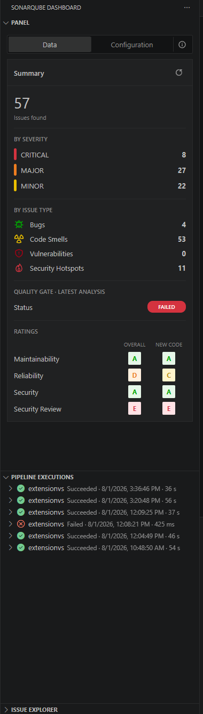
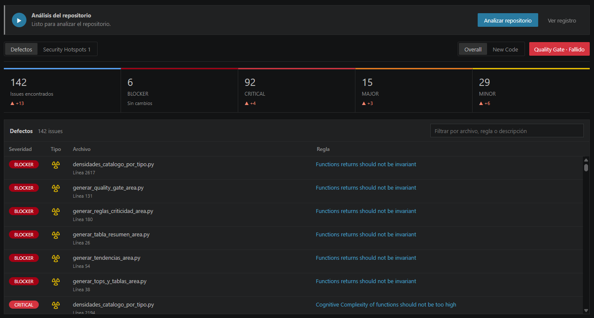
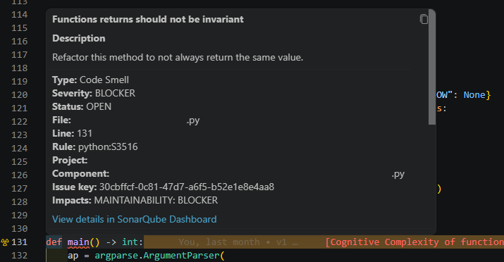
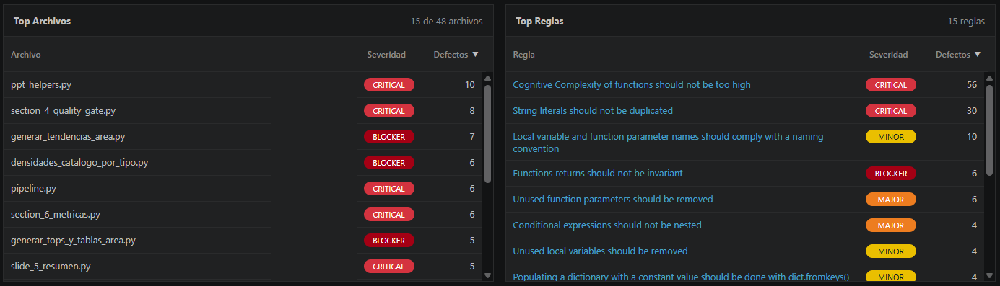
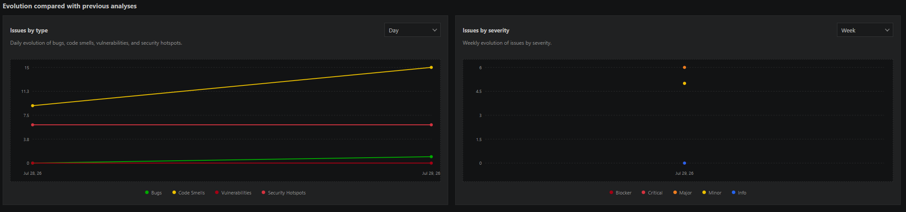
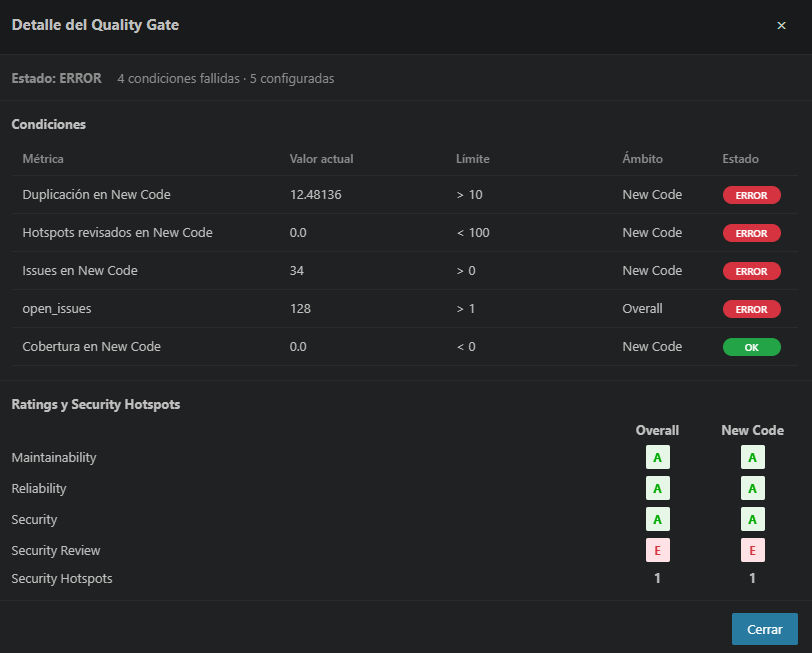
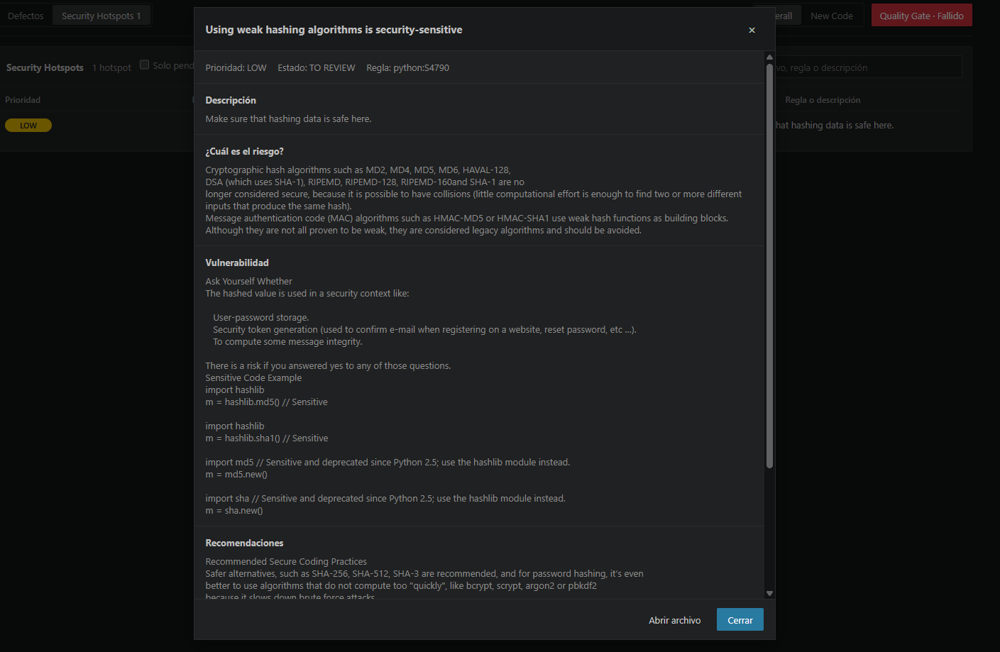
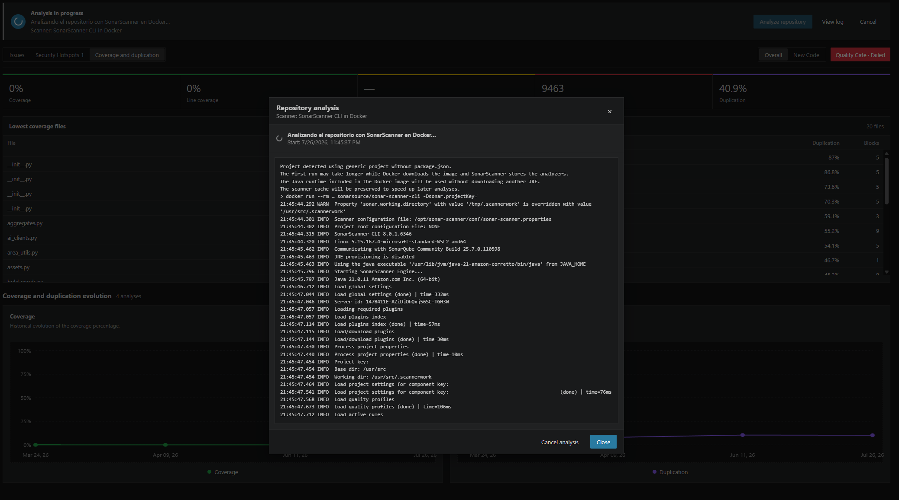
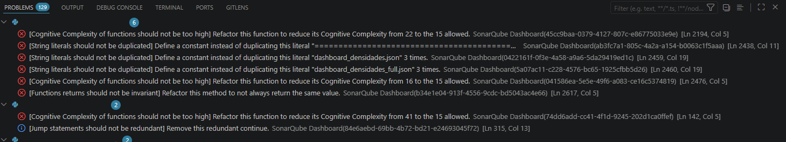
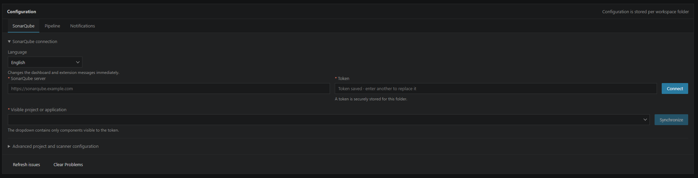

# SonarQube Dashboard for Visual Studio Code

**English** | [Español](README.es.md)

SonarQube Dashboard connects each workspace folder to a SonarQube project and brings its results directly into the Visual Studio Code workflow.

The extension can run a new repository analysis, inspect project status, compare **Overall** and **New Code**, review issues and Security Hotspots, analyze changes between scans, and publish findings directly in the **Problems** panel.

## Requirements

For SonarQube Dashboard to work correctly:

1. The application must already have been analyzed in SonarQube at least once.
2. The local folder for that same application must be open in Visual Studio Code.
3. The open folder must be linked to the corresponding SonarQube project from the **Configuration** tab.

The extension compares component paths returned by SonarQube with files found inside the open folder. The dashboard and **Problems** panel only show findings that can be matched to an existing local file.

When the analyzed code is located inside a workspace subfolder, configure it under **Advanced configuration → Local subfolder**. An incorrect project, folder, or subfolder mapping can cause SonarQube to contain issues that do not appear in the extension.

## Main features

- Run repository analysis from VS Code with automatic scanner detection.
- Support for Maven and Gradle projects using Java or Kotlin, SonarScanner for .NET for C#/VB.NET/F#, SonarScanner for NPM for projects containing `package.json`, and SonarScanner CLI through Docker for generic projects.
- Manual selection of Maven, Gradle, .NET, NPM, Docker, or a custom command.
- Automatic synchronization when opening an already linked project.
- Independent configuration for each workspace folder.
- Interface language selector with immediate switching between English and Spanish.
- Token protection through `SecretStorage`.
- Global **Overall / New Code** selector.
- Summaries by severity and issue type.
- Maintainability, Reliability, Security, and Security Review ratings.
- Quality Gate status and full condition details.
- Filterable issue table with direct navigation to source code.
- Issue lifecycle management without leaving VS Code: accept, false positive, reopen, assignment, comments, history, and current assignee.
- Security execution-flow navigation with source, intermediate steps, sink, secondary locations, CodeLens, and editor decorations.
- Coverage and duplication view with global/New Code metrics, gutter decorations, duplicated blocks, low-coverage files, and historical trends.
- Keyboard navigation, status-bar counter, and an issue explorer grouped by file, rule, or severity.
- Automatic regression notifications for critical issues, Quality Gate failures, issue increases, new hotspots, and completed analyses.
- Dedicated Security Hotspots table.
- File and rule rankings with sortable columns.
- Historical evolution by issue type and severity.
- Native diagnostics published in **Problems**.
- Support for branches and local subfolders.

## Quick start

1. Make sure the application already has at least one analysis available in SonarQube.
2. Open the local folder for that same application in VS Code.
3. Select the **SonarQube Dashboard** icon in the Activity Bar.
4. Open the **Configuration** tab.
5. Select **English** or **Español** from the language dropdown. The dashboard, side panel, notifications, dialogs, and scanner messages update immediately.
6. Enter the server URL and an access token.
7. Select **Connect and load projects**.
8. Link the folder to the SonarQube project or application that analyzes that code.
9. Optionally configure the branch and, when paths do not start at the workspace root, the local subfolder.
10. Select **Save and synchronize**.
11. On the **Data** page, select **Analyze repository** to create and submit a new analysis.

After the first link is created, the extension synchronizes data automatically whenever the workspace is opened. The refresh icon in the side panel can be used to request a manual update.

## Side panel



The side panel provides a quick overview without leaving the VS Code explorer:

- **Data / Configuration:** switch between the summary and project connection.
- **Refresh:** query SonarQube again and update both the dashboard and Problems.
- **Issues found:** total number of issues matched to files that exist in the linked folder.
- **Severities:** distribution of Blocker, Critical, Major, Minor, and Info among those local issues.
- **Types:** Bugs, Code Smells, Vulnerabilities, and Security Hotspots whose paths match a local file.
- **Quality Gate:** status of the latest analysis. Select it to open the detailed view.
- **Ratings:** direct Overall and New Code comparison using A–E badges.

While synchronization is running, the panel displays a spinner and temporarily hides the previous data to avoid presenting a partial state.

## Data view and Overall / New Code selector



The global **Overall / New Code** selector updates all of the following together:

- the top summary;
- the issues table;
- Security Hotspots;
- Top Files;
- Top Rules;
- historical charts.

**Overall** represents the complete project state. **New Code** limits the view to the new-code period configured in SonarQube.

### Top summary

Each column displays:

- the current value;
- the corresponding severity;
- the increase or decrease compared with the previous analysis;
- the official color used throughout the dashboard.

The `▲` and `▼` indicators make regressions and improvements easier to identify. When there is no variation, **No changes** is displayed.

Historical comparison is shown only when the total from the latest SonarQube analysis matches the issues associated with local files. When paths are omitted, the extension avoids comparing the local subset against the project's global total.

### Issues table

The table contains:

- **Severity:** issue criticality.
- **Type:** Bug, Code Smell, or Vulnerability icon.
- **File:** final filename and affected line; the tooltip preserves the complete path.
- **Rule:** descriptive SonarQube rule name.

The search field filters by file, rule, or description. Selecting a row opens the local file at the affected line. Selecting the rule opens its description in a dialog.

Only issues whose SonarQube component matches a file in the open folder are included, taking the configured local subfolder into account.

The header remains fixed while only the table body scrolls vertically.

### In-editor indicators and issue details



When a file containing findings is opened, the extension marks the affected lines directly in the editor:

- the gutter, to the left of the line number, displays the same icon and color used in the summary for **Bug**, **Code Smell**, **Vulnerability**, and **Security Hotspot**;
- the affected line is highlighted with the corresponding finding-type color and a marker is added to the editor overview ruler;
- hovering over the icon displays the description, rule, type, severity or priority, status, resolution, file, line, project, component, identifier, and available impacts;
- the tooltip link opens the complete issue or Security Hotspot details in **SonarQube Dashboard**.

Indicators are only created for findings whose SonarQube path matches a real file in the linked folder. They are refreshed when dashboard data is synchronized and removed when its data is cleared.

## Top Files and Top Rules



### Top Files

Groups issues by file and displays:

- final filename;
- complete path in the tooltip;
- highest severity found;
- total number of issues.

### Top Rules

Groups issues by rule and displays:

- descriptive rule name;
- highest severity;
- number of occurrences.

Both tables can be sorted by selecting **File/Rule**, **Severity**, or **Issues**. Selecting the same header again reverses the order, and the `▲` or `▼` indicator shows the active direction.

The headers remain outside the scrollable area, and both tables keep the same height.

## Historical evolution



The lower section contains two charts:

- **Issues by type:** Bugs, Code Smells, Vulnerabilities, and Security Hotspots.
- **Issues by severity:** Blocker, Critical, Major, Minor, and Info.

Each point represents a previous analysis. Moving the pointer over a chart displays a tooltip that follows the cursor and shows the date and values for every visible series.

The legends are centered and interactive. Select a series to hide it or display it again.

## Quality Gate



The Quality Gate button opens a dialog containing:

- global status of the latest analysis;
- number of failed and configured conditions;
- evaluated metric;
- current value;
- allowed limit;
- Overall or New Code scope;
- individual result for every condition;
- Overall and New Code ratings;
- number of Security Hotspots.

Failed conditions are listed first. The dialog distinguishes between the total number of configured conditions and the failed conditions displayed by SonarQube in its interface.

The dialog is divided into **header**, **body**, and **footer**. Only the body scrolls, so the title and action buttons remain visible.


## Issue lifecycle management

Select **Manage issue** from the Issues table, an editor hover, or the issue explorer to open the lifecycle dialog. Depending on the operations returned by SonarQube for the current token, the dialog can:

- accept an issue;
- mark it as false positive or won’t fix;
- reopen, confirm, or resolve it;
- assign or unassign a user;
- add comments;
- inspect comments, change history, author, dates, status, resolution, and assignee.

Every write operation displays a native confirmation dialog before SonarQube is modified. Status buttons are created only from the transitions included by `/api/issues/search`; assignment controls follow the actions returned for the issue, and the available-user list is paginated. Server-side authorization remains the final source of truth and API errors are displayed without discarding the current dashboard state.
The current status is displayed in the Issues table and in the dialog; its matching action is disabled. Comments and history use mutually exclusive collapsible sections.

## Security flows and secondary locations

Issues that include execution flows expose all local locations involved in the finding:

- source;
- intermediate steps;
- sink;
- other related locations.

The lifecycle dialog includes **Previous** and **Next** controls and a complete location list. Selecting a location opens the corresponding file and line. While a flow is active, VS Code displays colored whole-line decorations and CodeLens entries so the path can be followed directly in the editor.

Locations that are part of the SonarQube flow but do not exist in the open workspace remain visible as unavailable and are never redirected to a different file with the same name.

## Coverage and duplications

The **Coverage and duplication** data tab provides separate Overall and New Code views for:

- coverage, line coverage, and condition coverage;
- lines to cover and uncovered lines;
- duplicated-line density, duplicated blocks, and duplicated lines;
- files with the lowest coverage;
- files with the highest duplication;
- historical coverage and duplication charts.

Selecting a file loads line-level data on demand. Covered, partially covered, and uncovered lines are marked in the gutter and overview ruler. Duplicated lines receive a dedicated decoration, and the detail dialog lists each duplicated block together with every matching local file and range.
Each duplication group can be opened in a dedicated Git-style comparison tab. It displays every local occurrence side by side with its original line numbers and provides direct navigation to the selected range.

Coverage requires the corresponding test reports to have been imported by the scanner during analysis. When SonarQube has no coverage data for a file, the extension leaves it undecorated.
Missing historical metrics are also displayed as unavailable rather than as an artificial 0%.

## Quick issue navigation

The extension contributes an **Issue explorer** below the side-panel summary. It can group local issues by file, rule, or severity and can be restricted to the active file.

Default shortcuts:

| Action | Windows/Linux | macOS |
|---|---|---|
| Next issue | `Ctrl+Alt+Down` | `Cmd+Alt+Down` |
| Previous issue | `Ctrl+Alt+Up` | `Cmd+Alt+Up` |
| Next issue of the same type | `Ctrl+Alt+T` | `Cmd+Alt+T` |
| Next Blocker/Critical issue | `Ctrl+Alt+C` | `Cmd+Alt+C` |

The status bar shows the current position, for example `3/12`, and opens the next issue when selected.
The explorer and navigation commands follow the active Overall/New Code scope.

## Automatic notifications

Notifications can be enabled or disabled from the dashboard configuration or VS Code settings. The extension notifies when synchronization detects:

- new Blocker, Critical, or High issues;
- a Quality Gate change from OK to WARN/ERROR;
- a configurable significant increase in local issues;
- new Security Hotspots;
- completion of an analysis launched by the extension.

The default significant-increase threshold is 20% with at least five additional issues. These values can be changed through `sonarQubeDashboard.notifications.significantIncreasePercent` and `sonarQubeDashboard.notifications.significantIncreaseMinimum`.
Notification baselines are persisted independently for each workspace folder, server, project, branch, and VS Code workspace.

## Security Hotspots



The **Security Hotspots** tab provides a dedicated view containing:

- High, Medium, or Low priority;
- To Review, Acknowledged, Fixed, or Safe status;
- file and line;
- rule or description;
- text filter;
- **Pending only** option.

Selecting a hotspot loads its details and opens a dialog containing:

- description;
- risk;
- vulnerability context;
- remediation guidance;
- direct access to the file.

The extension loads hotspot details on demand so they do not delay the initial dashboard load.

## Repository analysis



The **Analyze repository** button detects the project type and selects the appropriate strategy:

- **Maven:** runs the `mvnw` wrapper or Maven with SonarScanner for Maven.
- **Gradle:** uses `gradlew` or Gradle. When the SonarQube plugin is not configured, the extension builds the project and runs the generic scanner using the Java binaries it finds.
- **.NET:** detects `.sln`, `.csproj`, `.vbproj`, and `.fsproj` files; installs SonarScanner for .NET inside extension storage and runs `begin`, build, and `end`.
- **NPM:** when `package.json` is found, runs `npx @sonar/scan`. This strategy is intended for JavaScript, TypeScript, React, and other Node.js projects.
- **Docker:** when no Maven, Gradle, .NET, or `package.json` descriptor is found, automatically uses the `sonarsource/sonar-scanner-cli` image. This is the generic strategy for Python and other languages without an NPM project.
- **Custom:** runs the configured command with the `SONAR_HOST_URL` and `SONAR_TOKEN` environment variables.

In **Automatic** mode, detection priority is **.NET → Maven → Gradle → NPM → Docker**. The search examines the analysis folder and its subfolders up to three levels deep. In mixed repositories, another method can be selected manually, or **Local subfolder** can be configured to restrict detection to the correct component.

SonarScanner for NPM reads the project's `package.json`. The extension does not create an artificial file: when the workspace does not contain one, it selects Docker directly and avoids launching NPX with an incompatible configuration.

The extension displays progress and the complete log, supports cancellation, waits for SonarQube to finish its background task, and then updates the dashboard and **Problems** automatically. The dialog can be closed while execution continues without stopping the analysis; **View log** opens it again. Only **Cancel analysis** terminates the scanner. The token is masked in the log.

Before enabling repository analysis, the extension queries the analysis-cache endpoint used by SonarScanner, which requires the **Execute Analysis** permission. If SonarQube rejects the request, analysis controls are hidden and the reason is shown in Configuration. A response indicating that no cache exists yet is considered valid. The backend repeats this validation before starting any scanner.

### Tool requirements

The extension includes orchestration and downloads SonarScanner for .NET automatically, but it does not include complete compilers or SDKs:

- Java/Kotlin requires a JDK and Maven/Gradle or its wrapper.
- C#, VB.NET, and F# require the .NET SDK.
- SonarScanner for NPM requires Node.js with `npx` and a `package.json`; when NPX is unavailable, Automatic mode tries Docker.
- Docker mode requires Docker Desktop or Docker Engine.

Docker preserves the SonarScanner cache between analyses and uses the Java runtime included in the image to reduce subsequent execution time.

Analysis can only run in a trusted workspace. The languages that can ultimately be analyzed also depend on the SonarQube edition, installed plugins, and server configuration.

## Problems integration



Overall issues are published as native VS Code diagnostics:

- grouped by file;
- displaying rule and description;
- including severity, line, and column;
- displaying the finding-type icon in the editor and exposing all available details from the affected line;
- identifying **SonarQube Dashboard** as the source;
- supporting one-click navigation to the code.

To avoid diagnostics being associated with the wrong files, an issue is not published when its SonarQube path cannot be resolved inside the linked folder.

The **Clear Problems** command removes only diagnostics published by this extension.

## Configuration



The configuration page manages:

- **SonarQube server:** base server URL.
- **Token:** credential used to query the API.
- **Project or application:** components visible to the token.
- **Branch:** optional branch to query.
- **Local subfolder:** mapping between the SonarQube root and a workspace folder.
- **Analysis method:** Automatic, Maven, Gradle, .NET, NPM, Docker, or Custom.
- **Build command:** optional command executed before the generic scanner or used instead of `dotnet build`.
- **Custom command:** integrates custom tools or processes without storing the token in the command.

### Token security

The token is stored through:

```typescript
ExtensionContext.secrets
```

Therefore:

- it is not written to `settings.json`;
- it is not included in the repository;
- it is not packaged inside the VSIX;
- it is stored independently for each VS Code environment.

Do not include real tokens in screenshots, issues, or project files.

## Synchronization

A synchronization performs these actions:

1. Reads the active folder configuration.
2. Queries Overall and New Code issues.
3. Queries Security Hotspots and their metrics.
4. Retrieves the Quality Gate, ratings, and history.
5. Matches SonarQube components to local files.
6. Publishes Overall diagnostics in Problems.
7. Updates the side panel and dashboard.

When the active folder changes, the extension selects the matching configuration. Previous requests are cancelled so a stale response cannot overwrite the current data.

## Available settings

```json
{
  "sonarQubeDashboard.language": "en",
  "sonarQubeDashboard.sonar.serverUrl": "",
  "sonarQubeDashboard.sonar.projectKey": "",
  "sonarQubeDashboard.sonar.branch": "",
  "sonarQubeDashboard.sonar.baseDir": "",
  "sonarQubeDashboard.sonar.scannerMode": "auto",
  "sonarQubeDashboard.sonar.buildCommand": "",
  "sonarQubeDashboard.sonar.customScannerCommand": "",
  "sonarQubeDashboard.autoRefresh": true,
  "sonarQubeDashboard.refreshIntervalMinutes": 0,
  "sonarQubeDashboard.notifications.enabled": true,
  "sonarQubeDashboard.notifications.significantIncreasePercent": 20,
  "sonarQubeDashboard.notifications.significantIncreaseMinimum": 5
}
```

`sonarQubeDashboard.language` accepts `en` or `es` and is stored globally for the VS Code environment. `autoRefresh` enables synchronization when opening or changing the workspace. A value greater than `0` for `refreshIntervalMinutes` enables periodic updates.

## Development

Install dependencies and compile:

```bash
npm install
npm run compile
```

Keep the compiler running:

```bash
npm run watch
```

Press `F5` in Visual Studio Code to run the extension in an **Extension Development Host**.

### Structure

```text
src/
├── constants.ts
├── dashboardPanel.ts
├── diagnostics.ts
├── extension.ts
├── sonarClient.ts
├── types.ts
├── scanner/
│   ├── analysisService.ts
│   ├── detector.ts
│   ├── processRunner.ts
│   └── types.ts
└── dashboard/
    ├── contracts.ts
    ├── summary.ts
    ├── components/
    ├── modals/
    ├── pages/
    ├── scripts/
    └── styles/
```

Colors, icons, severities, types, statuses, and metrics are centralized. Webview pages, components, scripts, dialogs, and styles are maintained in separate modules.

## Generate the VSIX

From PowerShell:

```powershell
.\generar-vsix.ps1
```

Without reinstalling dependencies:

```powershell
.\generar-vsix.ps1 -SinInstalarDependencias
```

You can also run:

```bat
generar-vsix.cmd
```

The VSIX uses the version defined in `package.json`.

## Install the VSIX

1. Open the Command Palette with `Ctrl + Shift + P`.
2. Run **Extensions: Install from VSIX...**.
3. Select `sonarqube-dashboard-<version>.vsix`.
4. Reload the window when requested by VS Code.

## Repository

- Source code: <https://github.com/jesusromero92/SonarQube-Dashboard_ExtensionVS>
- Issues: <https://github.com/jesusromero92/SonarQube-Dashboard_ExtensionVS/issues>

## License

See [LICENSE](LICENSE) for usage and distribution terms.

This license is not an Open Source Initiative-approved license because it restricts modification and distribution of derivative works.
